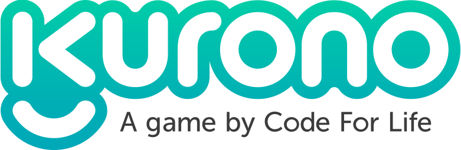

# Kurono (codename: aimmo)

  

[Code for Life](https://www.codeforlife.education/) has been developed by Ocado Technology as a **free, open-source** project to inspire the next generation of computer scientists and to help teachers deliver the computing curriculum.

**Kurono** is a [Code for Life](https://www.codeforlife.education/) project, aimed at teaching students and keen adults programming with Python. The game is designed to be played in a class or a group setting, as it simulates a multiplayer online game.

We are open to contributors from anywhere around the world. Please read ahead if you'd like to get involved.

## To get started

- [Developer Guide](https://docs.codeforlife.education/developer-guide)

- [Good First Issues](https://github.com/ocadotechnology/aimmo/contribute)

- Setting up your work environment: [common setup](https://docs.codeforlife.education/git/common-setup) and [aimmo specific setup](https://docs.codeforlife.education/git/aimmo-setup)

- [Testing](https://docs.codeforlife.education/git/testing)

    
  

