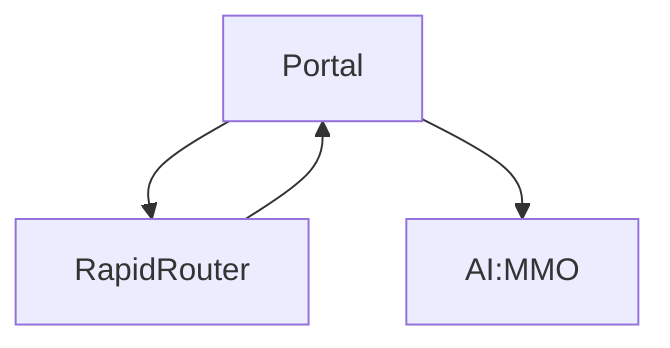
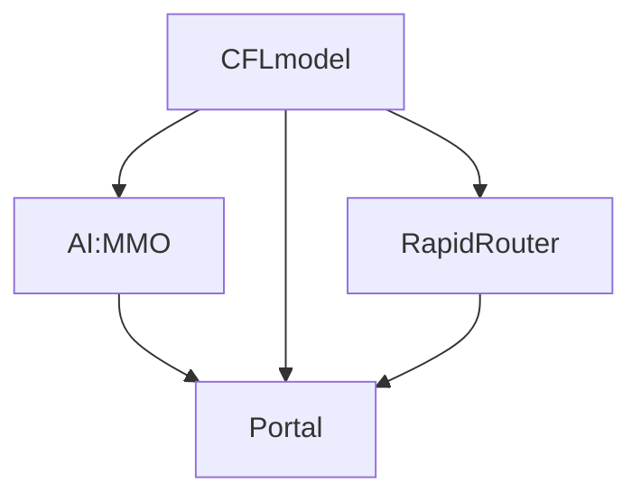

# CFL Refactor (remove the circular dependancies) 
Currently upgrading versions for our different projects is far more effort than it needs to be. So it has been discussed by members of the team that a refactor might be worth looking into.

## Old model

Currently there is a circular dependency between Rapid-Router and the Portal, (see above diagram). This has lead to code that is messy in places, and has made upgrading package versions incredibly difficult. This has been an issue for a number of years it seems, with mentions to it [here](https://github.com/ocadotechnology/rapid-router/issues/688) and [here](https://github.com/ocadotechnology/rapid-router/issues/658) dating back to 2015.

While this is a long and potentially challenging task, i feel it would make long term development and maintenance of the various repositories significantly easier. 

## Solutions

### Refactor to new model

The above diagram shows a new model with which to organise our current projects. This model should eliminate the currently existing circular dependancy and should prevent it from occurring in future. The main idea involves separating the models section from portal, and placing it within it's own repository if needed, (written as "CFLmodel" within this document). this CFLmodel would contain all the things the models currently do within the portal repository, this includes: Storing and retrieving data, validating data, relations between the data, and how the data can behave. 

This CFLmodel would optionally include common styles used throughout our projects, one notable example being the banner on the portal website.

From this our games (Rapid-Router & AI:MMO) can simply import the models they need directly instead of going through portal. Then Portal itself can also simply import our models directly, and then also import AI:MMO & Rapid-Router (And any other game/app we may develop in future). 

With the setup, updating package versions becomes a much simpler process. As first we need to upgrade our models to the desired version, then we can upgrade AI:MMO and/or Rapid-Router, and finally once all of that has been upgraded we can upgrade Portal.

In conclusion, this approach would require potentially a lot of refactoring of our codebases. However most of the work should just involve changing where the imports come from, and creating this need CFLmodel repository.

### Dependancy injections

This is the other proposed solution. it has 3 key concepts, which are as follows:
 * Components do not know each other directly.
 * Components specify external dependencies using some kind of a key.
 * Some "superior instance" (the IoC container, for example) resolves the dependencies once for each component and hereby "wires" the components together.

These are taken from [this](https://wiki.python.org/moin/DependencyInjectionPattern) python wiki page, i've also linked to a page explaining the idea in more detail [here](http://code.activestate.com/recipes/413268/).

The advantage of this approach over the previous one, is that this will not require as significant a refactor of our code, I have also been told there is an existing example of this within AI:MMO which we can use as reference.
