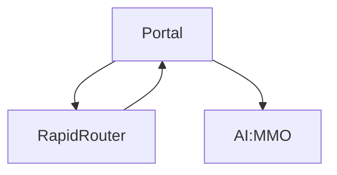
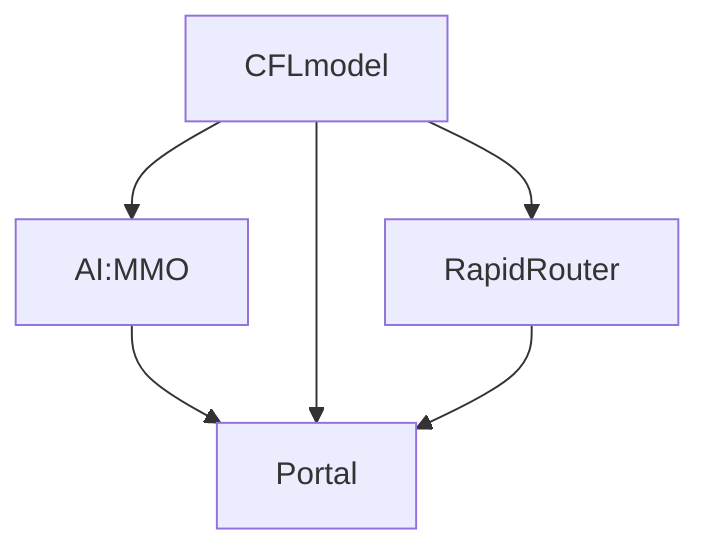

# CFL Refactor (remove the circular dependancies) 
Currently, upgrading our different projects is far more effort than it needs to be. So it has been discussed by members of the team that a refactor might be worth looking into.

## Old model

There is a circular dependency between Rapid-Router and the Portal, (see above diagram). This has led to code that is messy in places and has made upgrading package versions difficult. This has been an issue for a few years, dating back to 2015. See past issues: here and here.

Whilst this is a challenging task, it would make long-term development and maintenance of the various repositories significantly easier.

## Solution ideas

### Option 1: Refactor to new model

The above diagram shows a new model with which to organise our current projects. This model should eliminate the currently existing circular dependancy and should prevent it from occurring in future. The main idea involves separating the models section from portal, and placing it within its own repository if needed, (written as "CFLmodel" within this document). This CFLmodel would contain all the things the models currently do within the portal repository, this includes: Storing and retrieving data, validating data, relations between the data, and how the data can behave. 

This CFLmodel would optionally include common styles used throughout our projects, one notable example being the banner on the portal website.

From this our games (Rapid-Router & AI:MMO) can simply import the models they need directly instead of going through portal. Then Portal itself can also simply import our models directly, and then also import AI:MMO & Rapid-Router (And any other game/app we may develop in future). 

With the setup, updating package versions would become a much simpler process. First, we would need to upgrade our models to the desired version, then we would be able to upgrade AI:MMO and/or Rapid-Router, and finally once that has been upgraded we can upgrade Portal.

#### Pros:
* Easier to understand the structure for a new contributor
* Clearer legacy code
* Easier to debug
#### Cons:
* May take a long time to complete
* More work

### Option 2: Dependancy injections

This option has 3 key concepts, which are as follows:
 * Components do not know each other directly.
 * Components specify external dependancies using some kind of a key.
 * Some "superior instance" (the IoC container, for example) resolves the dependancies once for each component and hereby "wires" the components together.

These are taken from [this](https://wiki.python.org/moin/DependencyInjectionPattern) python wiki page, I've also linked to a page explaining the idea in more detail [here](http://code.activestate.com/recipes/413268/).

#### Pros:
* Faster to implement
#### Cons:
* Doesn't fix legacy code issues
* Harder to debug
