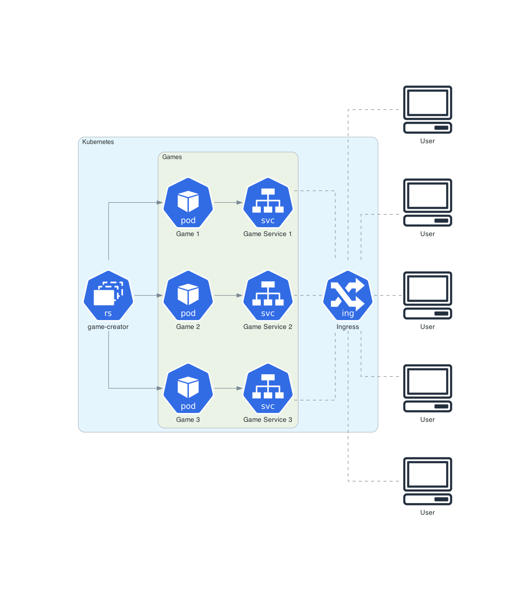

# Architecture

This section describes the whole game architecture and how things are structured. Kurono consists of five main components, split into their own directories.

## Overview

## Components

[The Django API (`aimmo` directory)](ui/README.md)

A Django app used to provide an api for game and code management.

[Game Frontend (`game_frontend` directory)](../../game_frontend/README.md)

A React app using [Babylon](https://www.babylonjs.com/) and [Pyodide](https://github.com/iodide-project/pyodide) to present the game state to the player, run their code and allow them to edit it.

[Games (`aimmo-game` directory)](games/README.md)

Holds and updates the game state (one per game).

[Game Creator (`aimmo-game-creator` directory)](game-creator/README.md)

Responsible for creating games (one globally).

[Workers (`aimmo-game-worker` directory)](workers/README.md)

Contains the avatar worker api used by the AvatarWorker in the frontend.

## Terminology

**Avatar:** a player's in-game representation. A player can have up to one per game.

**Player:** an individual with an account.
