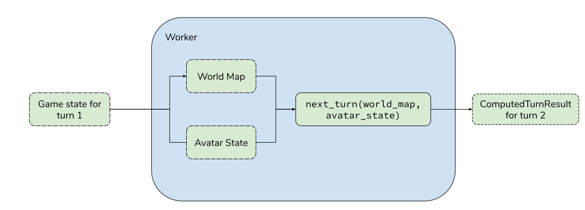

# Workers

The game worker is part of the [game_frontend](../../../game_frontend/README.md). Its responsibility is to run the player's code to get an action with any logs for a particular turn in the game.

The code for the worker is split up in two places:

- The [aimmo-game-worker](../../../aimmo-game-worker/) directory which holds the worker api source code for the player
- The corresponding [Pyodide runner](../../../game_frontend/src/pyodide) which uses the worker api to run the player's code.

## How the Avatar Worker works

The worker receives a game state of the current turn. It converts this into a representation of the world map and the avatar state (the classes for these can be found in the worker api package). These are then passed to the player's `next_turn` function. We collect the action returned from that function call along with any logs produced (via print statements or errors for example) to produce a `ComputedTurnResult` for the next turn.

### Responding to player's code changes

When the player changes the code for their avatar, we redefine the `next_turn` function in pyodide and then recompute their `next_turn` action with then the new code. In the case of syntax errors with their code, we don't compute their `next_turn` and return a `WaitAction` with the errors they had in the logs.
